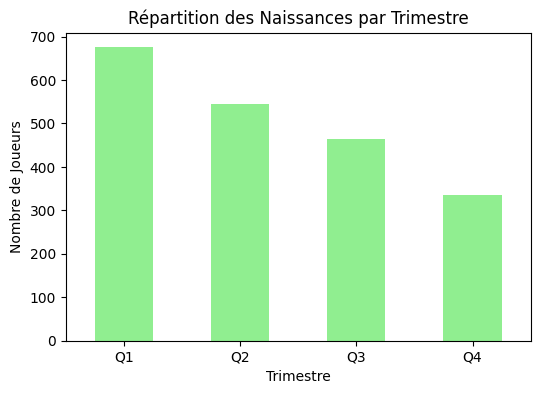

# Relative Age Effect in The Tunisian Football

## Introduction
The Relative Age Effect (RAE) refers to the advantage that relatively older athletes within an age category have over their younger peers due to physical and cognitive maturity differences. This study investigates the presence and impact of RAE in Tunisian football by analyzing birthdate distributions of over 2000 players across different levels of competition. Using statistical methods, we examine whether early-born players are overrepresented and assess the implications of RAE on talent development. The results highlight systematic biases in player selection, influencing the pipeline for elite footballers in Tunisia. Our findings provide insights for football academies, federations, and policymakers to implement more equitable selection processes.

## Blog Post
For more details, check out the [blog post](https://medium.com/@football.hacker/relative-age-effect-in-the-tunisian-football-d10af976c683) where we dive deeper into the project.

## Results
Here is an example result from the project that shows the unequal distribution of births per quarter:

## How to Use
I provided a dataset in a CSV file named tnplayers, which contains Tunisian players who have played in Tunisian clubs since 2000, especially in Ligue 1.

The data was mainly scraped from Transfermarkt, which is why you might notice some missing entries. However, this is the best we can do for now due to the lack of reliable data sources. Information about bi-national players who were not born in Tunisia has been excluded. We focused only on players who were born and raised in Tunisia.

Besides the dataset, there is a notebook that contains the code to analyze the data and generate visualizations. The analysis can be extended beyond the simple case presented in the notebook.
